**English** · [Українська](README.uk.md)

# Shruti AI

**Record and transcribe work meetings** — Slack huddles, Google Meet, Zoom,
phone calls. For Windows and macOS.

The app records **two separate channels**: your microphone and the audio from
your computer (the other participants). That is why the transcript shows who
said what. Recordings, transcripts and keys stay **on your computer** — there
is no server of ours involved.

> ⬇️ **[Download the latest version](../../releases/latest)**

---

## What it does

- 🌐 **Interface in three languages** — English, Ukrainian, Russian. The
  language follows your system and can be changed in settings at any time.
- 🎙 **Meeting recording** — microphone and system audio as separate channels.
- 🔇 **System-level microphone mute** — one button silences it both for Slack
  and for the recording. The button lives in the header and is available at any
  time, so there is no separate utility to keep around and background
  conversations never reach the transcript. Both buttons act on **one microphone
  chosen for the whole app** — by default the system one.
- ⏸ **Pause** and a **floating panel** on top of other windows — audio levels
  are visible, pause and microphone are right there, and it does not steal
  focus from Slack.
- 🔊 **Microphone level keeper** — Slack and Telegram lower your input gain and
  never raise it back; the app restores it. It works **always**, not only while
  recording, so calls and voice notes keep a high level too.
- ⚡ **Live transcription** — text appears while you are talking (needs an
  OpenAI key; enabled in settings, off by default).
- 📝 **High-quality transcript after recording** — split by speakers; long
  files are automatically chunked.
- 🧠 **Meeting summary** — TL;DR, participants, topics, agreements, tasks.
- 🌍 **Bilingual conversations** — written in the original language, with no
  translation; English terms stay English.
- 📁 **Local files** — each recording is a folder with audio and `.md`
  transcripts.
- 📥 **Import existing audio** — transcribe what you recorded elsewhere.

## What it looks like

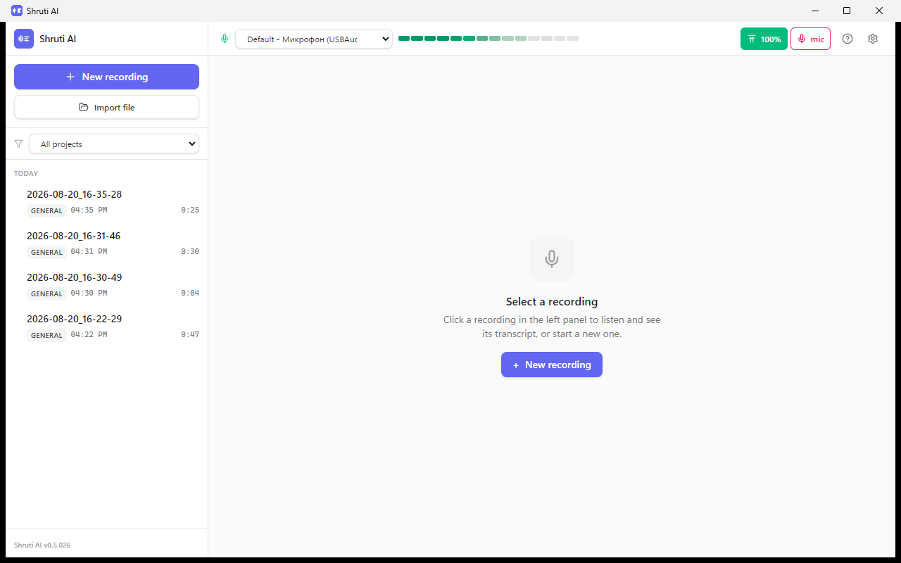

The main window. The microphone lives in the header: pick the device, watch the
level, mute it or hold the gain — **at any time**, not only while recording.

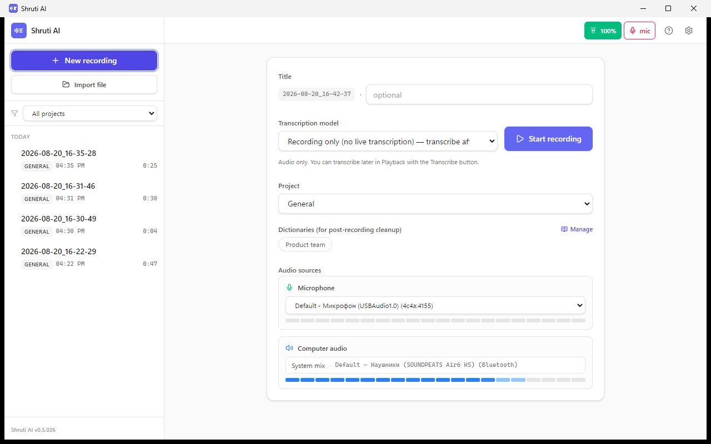

Setting up a recording: microphone and computer audio as separate channels,
with levels visible before you start.

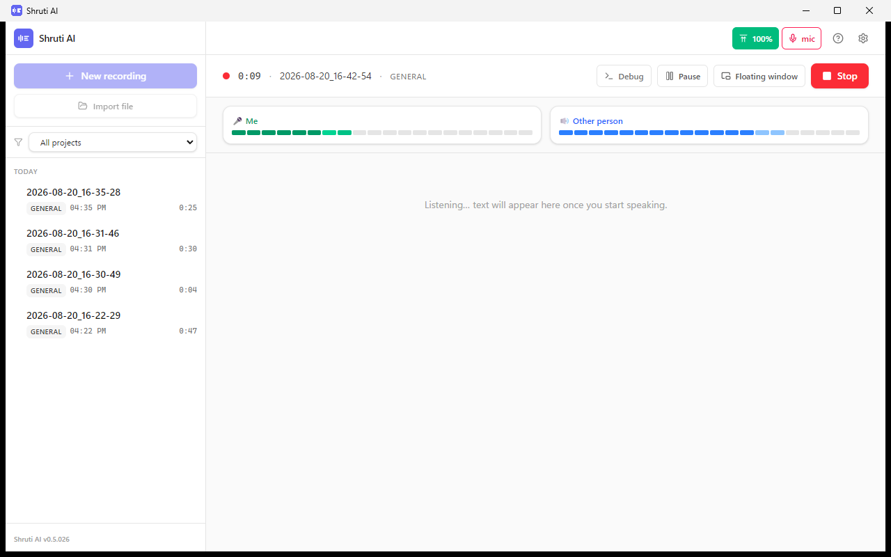

While recording you see both channels separately: “Me” and “Other person”.

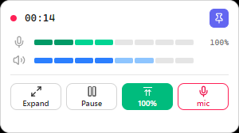

The floating panel on top of other windows: levels, pause, microphone. It does
not steal focus from Slack.

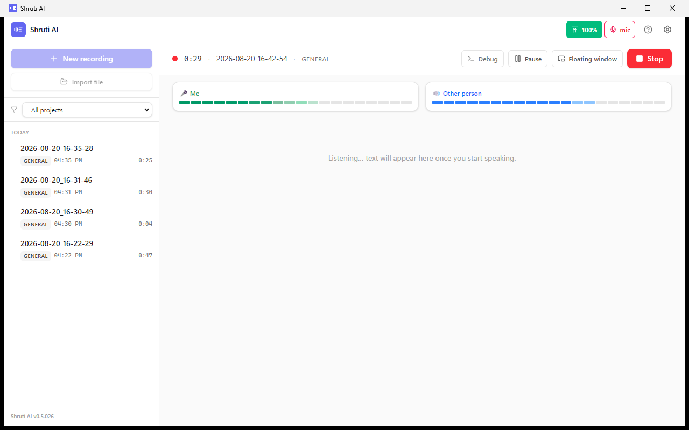

A finished recording: player, transcript and summary. “Stereo” switches to mono —
handy if you listen with a single earbud.

<b>The rest of the screens</b>

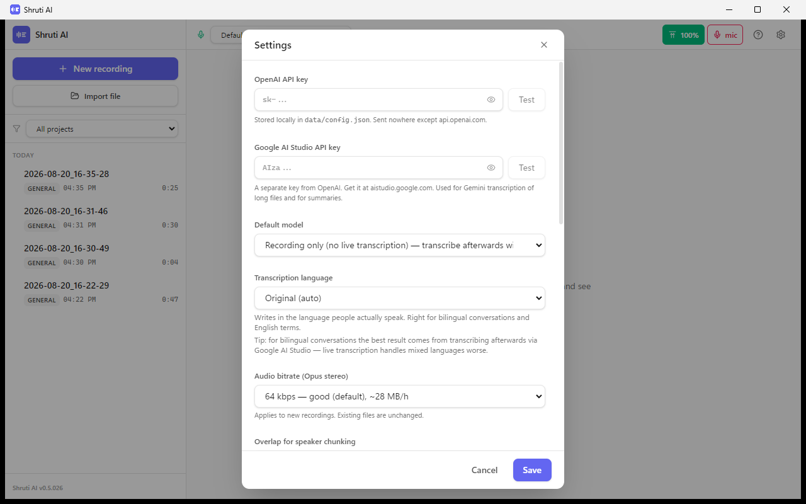

Settings: keys, model, transcription language, audio quality.

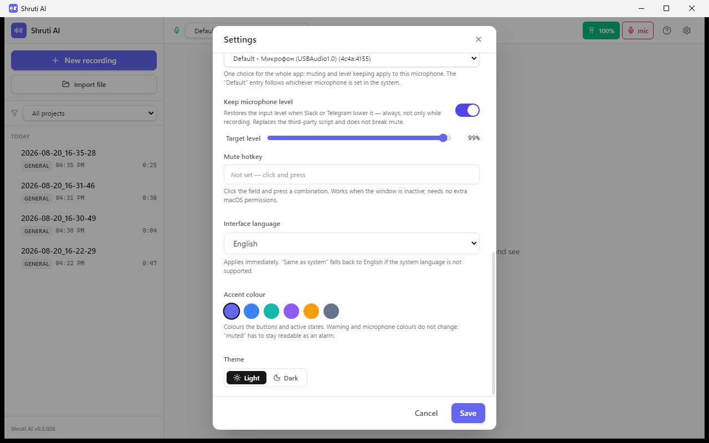

One microphone choice for the whole app, the target level and the hotkey.

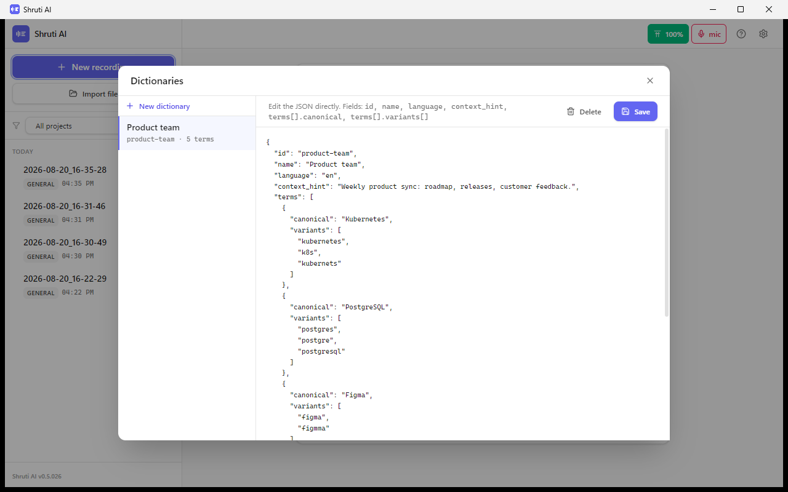

Dictionaries: terms the model tends to garble, with their spelling variants.

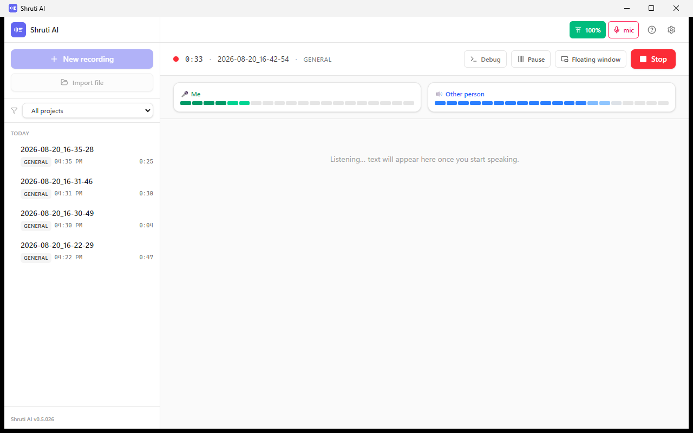

Importing existing audio — transcribe what you recorded with another tool.

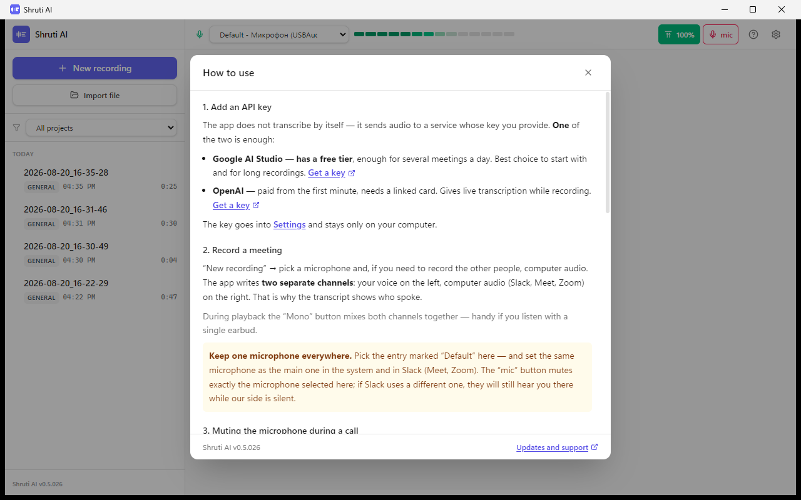

Built-in help: keys, recording, permissions, files.

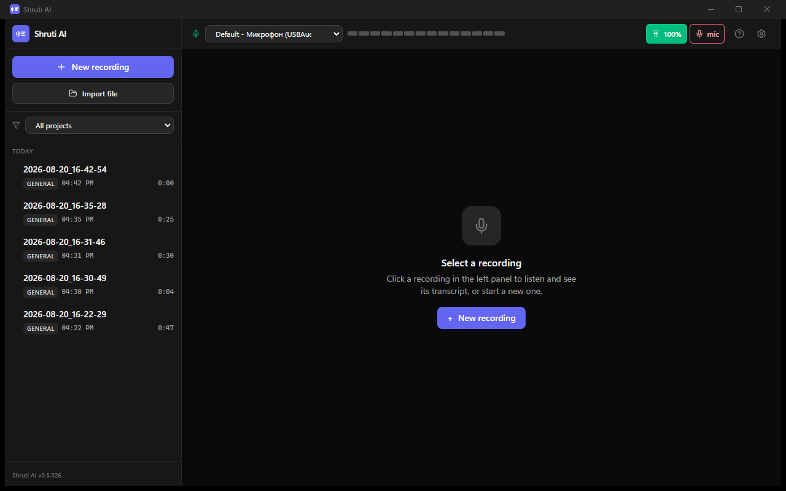

Dark theme.

## Installation

### Windows

1. Download `ShrutiAI-<version>-portable.exe` from the
   [releases page](../../releases/latest).
2. Run it. Windows shows a blue **“Windows protected your PC”** window — this
   is normal for apps without a paid signing certificate.
   Click **More info → Run anyway**.
3. The app is portable: no installation, no administrator rights. Recordings
   are kept in a `data` folder next to the executable — move the folder and
   all recordings move with it.

### macOS (Apple Silicon)

The app is signed with our own certificate rather than one bought from Apple,
so macOS blocks the first launch. This is normal and happens once.

1. Download `ShrutiAI-<version>-arm64.dmg`, open it and drag the app into
   **Applications**.
2. Launch it from **Applications**. A window appears: “Shruti AI was not
   opened, Apple could not verify that it is free of malware”.
   Click **“Done”**. ⚠️ **Do not click “Move to Trash”** — that deletes the app.
3. Open **System Settings → Privacy & Security**, scroll down to the
   **Security** section. There will be a line about Shruti AI being blocked
   and an **“Open Anyway”** button — click it and confirm with Touch ID or
   your password.
4. The app starts. From now on it opens like any other program.

> The old “right-click → Open” trick **no longer works** on modern macOS:
> that button is simply not present in the blocking dialog.

5. To record meeting audio, grant one more permission:
   **System Settings → Privacy & Security → Screen & System Audio Recording**
   → enable **Shruti AI** → **restart the app**.
   Without it only your own microphone is recorded and the other participants
   will not be heard.
6. Recordings are kept in `Documents/ShrutiAI`.

## First run: you need an API key

The app does not transcribe by itself — it sends audio to the service you
choose. **One** key is enough:

| Service | Cost | What you get |
|---|---|---|
| **[Google AI Studio](https://aistudio.google.com/apikey)** | **has a free tier** — enough for a few meetings a day | Best for long recordings and bilingual conversations |
| **[OpenAI](https://platform.openai.com/api-keys)** | paid, requires a card | Live transcription while recording |

The key goes into **Settings** (the gear in the top right) and stays only on
your computer.

Not sure where to start — take Google AI Studio.

## How to record a meeting

1. **New recording** → pick a microphone and system audio.
2. Hold your meeting. The app can be minimised.
3. **Stop** → the recording appears in the list on the left.
4. **Transcribe** — get a quality transcript split by speakers.
5. **Generate summary** — a short recap with action items.

💡 During playback the **“Mono”** button mixes both channels into one — handy
if you listen with a single earbud.

💡 The **“mic”** button in the header mutes your microphone **at the system
level** — Slack and the recording both stop hearing you. You can assign a
hotkey in Settings so you never have to switch to the app window.

⚠️ **Keep one microphone everywhere.** In the microphone list pick the entry
marked **“Default”**, and set the same microphone as the main one in your
system and in Slack (Meet, Zoom). The “mic” button mutes exactly the
microphone selected in Shruti: if Slack uses a different one, they will still
hear you there while the recording is silent.

## Bilingual meetings

The default is **“Original (auto)”**: the transcript is written in the
language people actually speak, and English terms stay in English. That is
what mixed conversations need.

For a bilingual conversation the most accurate result comes from
**transcribing via Google AI Studio** after the recording. Live transcription
handles mixed languages worse.

## Privacy

- Audio is sent **only** to the service whose key you entered (OpenAI or
  Google) — solely for speech recognition.
- Recordings, transcripts and keys are stored **locally** on your computer.
- The developer **receives** none of your recordings, keys or statistics.
  There are no accounts and no telemetry.
- Remember: in many countries and companies recording a conversation requires
  **the consent of the other participants**. Tell them.

## FAQ

<b>Why does Windows/macOS show a scary warning?</b>

Because the app is not signed with a paid certificate (Windows — from $200 a
year, Apple — $99 a year). This is not about the safety of the code itself:
any program without such a certificate gets the same warning. Instructions to
get past it are above.

On macOS the blocking dialog has a **“Move to Trash”** button — it is blue and
looks like the primary action. Do not click it: you need **“Done”**, and then
the permission in System Settings (step 3 above).

<b>How much does it cost?</b>

The app itself is free. You only pay for speech recognition, to the service
whose key you use. Google AI Studio has a free tier that usually covers a few
meetings a day.

<b>Can I record a Zoom / Meet / Slack call?</b>

Yes — the app records system audio, so everyone is audible regardless of the
platform. On macOS this needs the screen recording permission (see above).

<b>Where are my recordings?</b>

Windows — a `data` folder next to the `.exe`. macOS — `Documents/ShrutiAI`.
Each recording is its own folder: audio plus transcripts in Markdown.

<b>Is there a version for Android / iPhone?</b>

An Android version exists but is distributed separately, not here. There is
no iOS version.

<b>Does it work on Intel Macs?</b>

Current builds are for Apple Silicon (M1 and newer).

## Support

Found a bug or have an idea — **[open an issue](../../issues/new)**.

It works better for everyone: the answer is visible to others with the same
question, and nothing gets lost in a mailbox. Please include three things:
**which system** (Windows or macOS), **which version** of the app (shown in the
bottom left) and **what exactly happened**.

If you would rather not write publicly, contact details are on the
[Simplaerai](https://github.com/simplaerai-sv) profile.

---

© Simplaerai. The app is provided “as is”, without warranties.
